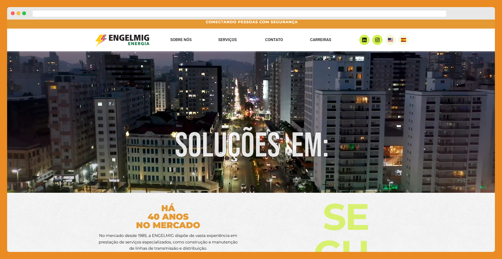

# Portfólio — Eric Nacif

[](https://react.dev/)
[](https://vitejs.dev/)
[](https://www.framer.com/motion/)


Site pessoal com foco em performance, mobile-first, modo escuro/claro, acessibilidade e microinterações. Projetos destacados, seção “Sobre mim” e formulário de contato.

- Live: [Adicionar URL do deploy aqui](ericnacif.netlify.app)
- Repositório: [ericnacif/eric-nacif-portfolio](https://github.com/ericnacif/eric-nacif-portfolio)

---

## Sumário
- [Tecnologias](#tecnologias)
- [Destaques](#destaques)
- [Screenshots](#screenshots)
- [Começando](#começando)
- [Scripts](#scripts)
- [Estrutura do projeto](#estrutura-do-projeto)
- [Como editar conteúdo](#como-editar-conteúdo)
- [Deploy](#deploy)
- [Acessibilidade](#acessibilidade)
- [Roadmap (ideias futuras)](#roadmap-ideias-futuras)
- [Contato](#contato)
- [Licença](#licença)
- [Créditos](#créditos)

## Tecnologias
- React + Vite
- Framer Motion (animações)
- CSS3 com variáveis e temas (dark/light)
- react-icons
- Formspree (contato)

## Destaques
- Mobile-first: navegação otimizada, menu sanduíche com animações e modal de detalhes de projetos no mobile.
- Sem rolagem lateral no mobile e com safe-area para elementos flutuantes.
- Modo escuro: ícones e cores adaptados automaticamente; ícones do footer ficam pretos no claro e brancos no escuro.
- Acessibilidade: foco visível, respeita prefers-reduced-motion, ARIA em overlays/modais, fechamento por Escape e clique fora.
- Performance: imagens com `loading="lazy"` e `decoding="async"`, assets leves, fontes otimizadas.

## Screenshots
> Atualize o link do deploy nas imagens se preferir.

- Projetos
  - 
- Institucional
  - 

## Começando
Requisitos: Node 18+ (recomendado 20+)

```bash
# Clonar
git clone https://github.com/ericnacif/eric-nacif-portfolio.git
cd eric-nacif-portfolio

# Instalar deps
npm install

# Ambiente de desenvolvimento
npm run dev
```

## Scripts
- `npm run dev` — inicia ambiente de desenvolvimento (Vite)
- `npm run build` — gera build de produção em `dist/`
- `npm run preview` — pré-visualiza o build localmente

## Estrutura do projeto
```text
src/
  assets/                     # imagens e ícones
  components/
    BackToTop.*              # botão "voltar ao topo" (mobile-aware)
    Cursor/*                 # cursor custom (só desktop)
    ExperienceList/*         # listas de experiência
    Footer/*                 # formulário + ícones sociais
    Header/*                 # cabeçalho + menu mobile
    ProjectCard/*            # card de projeto + modal de detalhes
    SkillCard/*              # card de skill
  sections/
    Hero/*                   # título animado
    Projects/*               # grade de projetos
    About/*                  # sobre mim + skills + experiência
  context/
    ThemeContext.*           # tema dark/light
  App.jsx
  main.jsx
index.html
```

## Como editar conteúdo

- Sobre mim e links (Instagram, GitHub, LinkedIn, Figma, e-mail):
  - Arquivo: `src/sections/About/About.jsx`
  - Objeto: `personalInfo`

- Skills (cards):
  - Arquivo: `src/sections/About/About.jsx`
  - Array: `skillsData`
  - Cada item: `{ icon, title, description }`

- Experiências (listas):
  - Arquivo: `src/sections/About/About.jsx`
  - Objeto: `experienceListsData`

- Projetos:
  - Arquivo: `src/sections/Projects/Projects.jsx`
  - Array: `projectsData`
  - Campos úteis: `title`, `description`, `contribution` (array), `tags`, `image`

- Ícones do Footer (links sociais):
  - Arquivo: `src/components/Footer/Footer.jsx`
  - Array: `socialLinks`

## Deploy

### Vercel (recomendado)
1. Importar o repositório pela conta GitHub.
2. Preset: Vite. Build: `npm run build`. Output: `dist`.
3. Adicionar domínio (ex.: `ericnacif.dev`) e configurar DNS:
   - A (apex) → `76.76.21.21`
   - CNAME (www) → `cname.vercel-dns.com`
4. SSL automático.

### GitHub Pages (alternativa)
1. Configure o workflow:
   - `.github/workflows/deploy-pages.yml` (Actions → pages)
2. Se usar como “project pages”, adicione no `vite.config.js`:
   ```js
   export default defineConfig({
     plugins: [react()],
     base: '/eric-nacif-portfolio/',
   })
   ```
3. Domínio próprio (opcional): arquivo `public/CNAME` com o domínio e DNS conforme GitHub Pages.

### Cloudflare Pages (alternativa)
1. Conecte o repo → configure build `npm run build`, output `dist/`.
2. Adicione o domínio em “Custom Domains” (se já estiver no Cloudflare, ele cuida do DNS).

## Acessibilidade
- Foco visível com `:focus-visible`.
- Respeita `prefers-reduced-motion`.
- Hero e ícones usam ARIA apropriado (`aria-label`, `aria-hidden`).
- Modais: trap de foco, fechamento via `Esc` e clique fora.
- Menu mobile: fecha ao clicar fora e por `Esc`.

## Roadmap (ideias futuras)
- Testes (Vitest + Testing Library)
- Imagens WebP/AVIF com `srcset`
- SEO (react-helmet-async + Open Graph/Twitter Cards)
- Integração CI (lint/test/build) no GitHub Actions

## Contato
- LinkedIn: [eric-nacif](https://www.linkedin.com/in/eric-nacif-956930324/)
- GitHub: [@ericnacif](https://github.com/ericnacif)
- Instagram: [@nacif_](https://www.instagram.com/nacif_/)
- Figma: [@nacif_eric](https://www.figma.com/@nacif_eric)
- E-mail: [naciferic7@gmail.com](mailto:naciferic7@gmail.com)

## Licença
Este repositório não possui licença explícita no momento.

## Créditos
- Desenvolvido por [Eric Nacif](https://github.com/ericnacif)